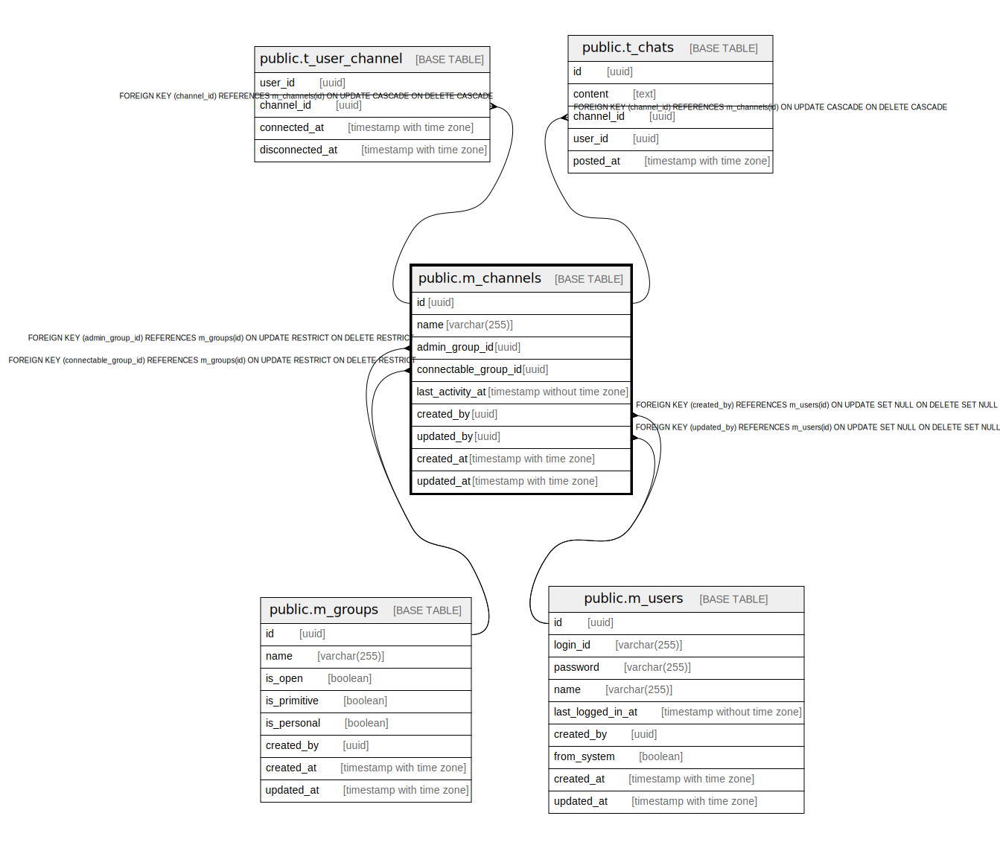

# public.m_channels

## Description

## Columns

| Name | Type | Default | Nullable | Children | Parents | Comment |
| ---- | ---- | ------- | -------- | -------- | ------- | ------- |
| id | uuid | uuid_generate_v4() | false | [public.t_user_channel](public.t_user_channel.md) [public.t_chats](public.t_chats.md) |  |  |
| name | varchar(255) |  | false |  |  |  |
| admin_group_id | uuid |  | false |  | [public.m_groups](public.m_groups.md) |  |
| connectable_group_id | uuid |  | false |  | [public.m_groups](public.m_groups.md) |  |
| last_activity_at | timestamp without time zone |  | true |  |  |  |
| created_by | uuid |  | true |  | [public.m_users](public.m_users.md) |  |
| updated_by | uuid |  | true |  | [public.m_users](public.m_users.md) |  |
| created_at | timestamp with time zone |  | false |  |  |  |
| updated_at | timestamp with time zone |  | false |  |  |  |

## Constraints

| Name | Type | Definition |
| ---- | ---- | ---------- |
| m_channels_created_by_fkey | FOREIGN KEY | FOREIGN KEY (created_by) REFERENCES m_users(id) ON UPDATE SET NULL ON DELETE SET NULL |
| m_channels_updated_by_fkey | FOREIGN KEY | FOREIGN KEY (updated_by) REFERENCES m_users(id) ON UPDATE SET NULL ON DELETE SET NULL |
| m_channels_admin_group_id_fkey | FOREIGN KEY | FOREIGN KEY (admin_group_id) REFERENCES m_groups(id) ON UPDATE RESTRICT ON DELETE RESTRICT |
| m_channels_connectable_group_id_fkey | FOREIGN KEY | FOREIGN KEY (connectable_group_id) REFERENCES m_groups(id) ON UPDATE RESTRICT ON DELETE RESTRICT |
| m_channels_pkey | PRIMARY KEY | PRIMARY KEY (id) |

## Indexes

| Name | Definition |
| ---- | ---------- |
| m_channels_pkey | CREATE UNIQUE INDEX m_channels_pkey ON public.m_channels USING btree (id) |
| idx_m_channels_name | CREATE INDEX idx_m_channels_name ON public.m_channels USING btree (name) |
| idx_m_channels_last_activity_at | CREATE INDEX idx_m_channels_last_activity_at ON public.m_channels USING btree (last_activity_at) |

## Relations

---

> Generated by [tbls](https://github.com/k1LoW/tbls)
