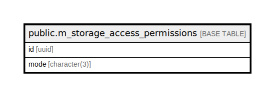

# public.m_storage_access_permissions

## Description

## Columns

| Name | Type | Default | Nullable | Children | Parents | Comment |
| ---- | ---- | ------- | -------- | -------- | ------- | ------- |
| id | uuid | uuid_generate_v4() | false |  |  |  |
| mode | character(3) |  | false |  |  |  |

## Constraints

| Name | Type | Definition |
| ---- | ---- | ---------- |
| m_storage_access_permissions_pkey | PRIMARY KEY | PRIMARY KEY (id) |

## Indexes

| Name | Definition |
| ---- | ---------- |
| m_storage_access_permissions_pkey | CREATE UNIQUE INDEX m_storage_access_permissions_pkey ON public.m_storage_access_permissions USING btree (id) |
| idx_m_storage_access_permissions_mode | CREATE INDEX idx_m_storage_access_permissions_mode ON public.m_storage_access_permissions USING btree (mode) |

## Relations

---

> Generated by [tbls](https://github.com/k1LoW/tbls)
