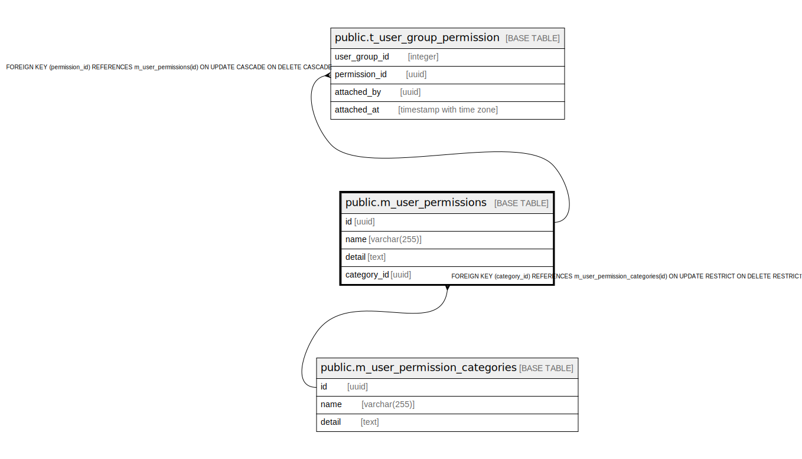

# public.m_user_permissions

## Description

## Columns

| Name | Type | Default | Nullable | Children | Parents | Comment |
| ---- | ---- | ------- | -------- | -------- | ------- | ------- |
| id | uuid | uuid_generate_v4() | false | [public.t_user_group_permission](public.t_user_group_permission.md) |  |  |
| name | varchar(255) |  | false |  |  |  |
| detail | text |  | false |  |  |  |
| category_id | uuid |  | false |  | [public.m_user_permission_categories](public.m_user_permission_categories.md) |  |

## Constraints

| Name | Type | Definition |
| ---- | ---- | ---------- |
| m_user_permissions_category_id_fkey | FOREIGN KEY | FOREIGN KEY (category_id) REFERENCES m_user_permission_categories(id) ON UPDATE RESTRICT ON DELETE RESTRICT |
| m_user_permissions_pkey | PRIMARY KEY | PRIMARY KEY (id) |

## Indexes

| Name | Definition |
| ---- | ---------- |
| m_user_permissions_pkey | CREATE UNIQUE INDEX m_user_permissions_pkey ON public.m_user_permissions USING btree (id) |
| idx_m_user_permissions_name | CREATE INDEX idx_m_user_permissions_name ON public.m_user_permissions USING btree (name) |

## Relations

---

> Generated by [tbls](https://github.com/k1LoW/tbls)
