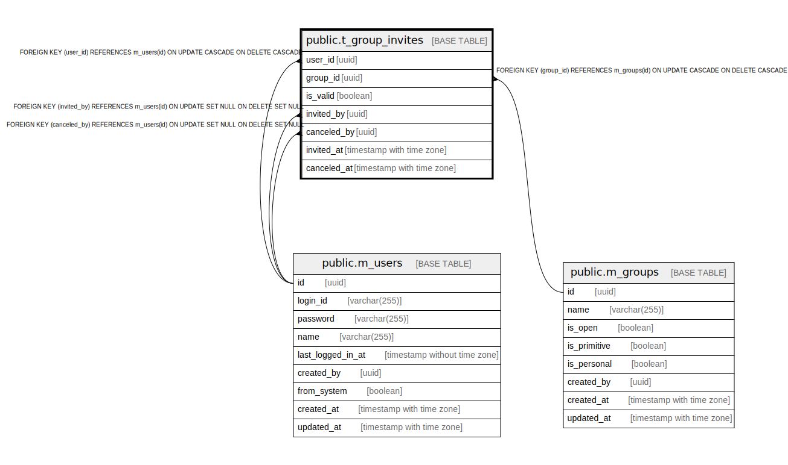

# public.t_group_invites

## Description

## Columns

| Name | Type | Default | Nullable | Children | Parents | Comment |
| ---- | ---- | ------- | -------- | -------- | ------- | ------- |
| user_id | uuid |  | false |  | [public.m_users](public.m_users.md) |  |
| group_id | uuid |  | false |  | [public.m_groups](public.m_groups.md) |  |
| is_valid | boolean | true | false |  |  |  |
| invited_by | uuid |  | true |  | [public.m_users](public.m_users.md) |  |
| canceled_by | uuid |  | true |  | [public.m_users](public.m_users.md) |  |
| invited_at | timestamp with time zone |  | false |  |  |  |
| canceled_at | timestamp with time zone |  | true |  |  |  |

## Constraints

| Name | Type | Definition |
| ---- | ---- | ---------- |
| t_group_invites_canceled_by_fkey | FOREIGN KEY | FOREIGN KEY (canceled_by) REFERENCES m_users(id) ON UPDATE SET NULL ON DELETE SET NULL |
| t_group_invites_invited_by_fkey | FOREIGN KEY | FOREIGN KEY (invited_by) REFERENCES m_users(id) ON UPDATE SET NULL ON DELETE SET NULL |
| t_group_invites_user_id_fkey | FOREIGN KEY | FOREIGN KEY (user_id) REFERENCES m_users(id) ON UPDATE CASCADE ON DELETE CASCADE |
| t_group_invites_group_id_fkey | FOREIGN KEY | FOREIGN KEY (group_id) REFERENCES m_groups(id) ON UPDATE CASCADE ON DELETE CASCADE |
| t_group_invites_pkey | PRIMARY KEY | PRIMARY KEY (user_id, group_id) |

## Indexes

| Name | Definition |
| ---- | ---------- |
| t_group_invites_pkey | CREATE UNIQUE INDEX t_group_invites_pkey ON public.t_group_invites USING btree (user_id, group_id) |

## Relations

---

> Generated by [tbls](https://github.com/k1LoW/tbls)
