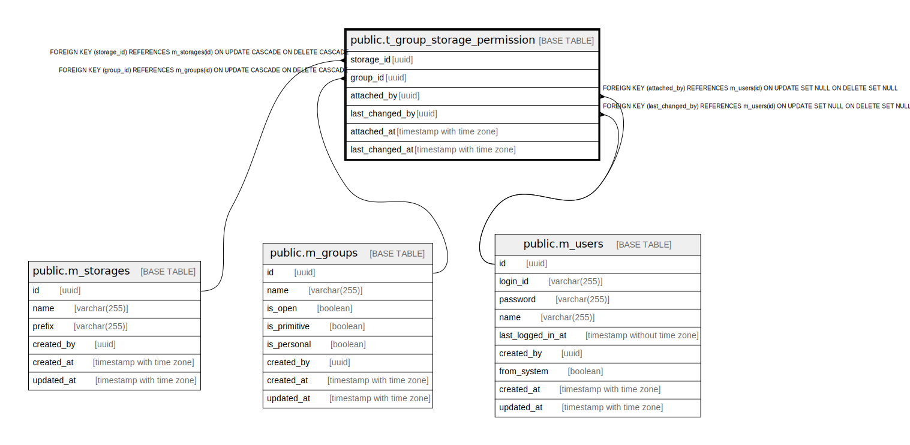

# public.t_group_storage_permission

## Description

## Columns

| Name | Type | Default | Nullable | Children | Parents | Comment |
| ---- | ---- | ------- | -------- | -------- | ------- | ------- |
| storage_id | uuid |  | false |  | [public.m_storages](public.m_storages.md) |  |
| group_id | uuid |  | false |  | [public.m_groups](public.m_groups.md) |  |
| attached_by | uuid |  | true |  | [public.m_users](public.m_users.md) |  |
| last_changed_by | uuid |  | true |  | [public.m_users](public.m_users.md) |  |
| attached_at | timestamp with time zone |  | false |  |  |  |
| last_changed_at | timestamp with time zone |  | false |  |  |  |

## Constraints

| Name | Type | Definition |
| ---- | ---- | ---------- |
| t_group_storage_permission_attached_by_fkey | FOREIGN KEY | FOREIGN KEY (attached_by) REFERENCES m_users(id) ON UPDATE SET NULL ON DELETE SET NULL |
| t_group_storage_permission_last_changed_by_fkey | FOREIGN KEY | FOREIGN KEY (last_changed_by) REFERENCES m_users(id) ON UPDATE SET NULL ON DELETE SET NULL |
| t_group_storage_permission_group_id_fkey | FOREIGN KEY | FOREIGN KEY (group_id) REFERENCES m_groups(id) ON UPDATE CASCADE ON DELETE CASCADE |
| t_group_storage_permission_storage_id_fkey | FOREIGN KEY | FOREIGN KEY (storage_id) REFERENCES m_storages(id) ON UPDATE CASCADE ON DELETE CASCADE |
| t_group_storage_permission_pkey | PRIMARY KEY | PRIMARY KEY (storage_id, group_id) |

## Indexes

| Name | Definition |
| ---- | ---------- |
| t_group_storage_permission_pkey | CREATE UNIQUE INDEX t_group_storage_permission_pkey ON public.t_group_storage_permission USING btree (storage_id, group_id) |

## Relations

---

> Generated by [tbls](https://github.com/k1LoW/tbls)
