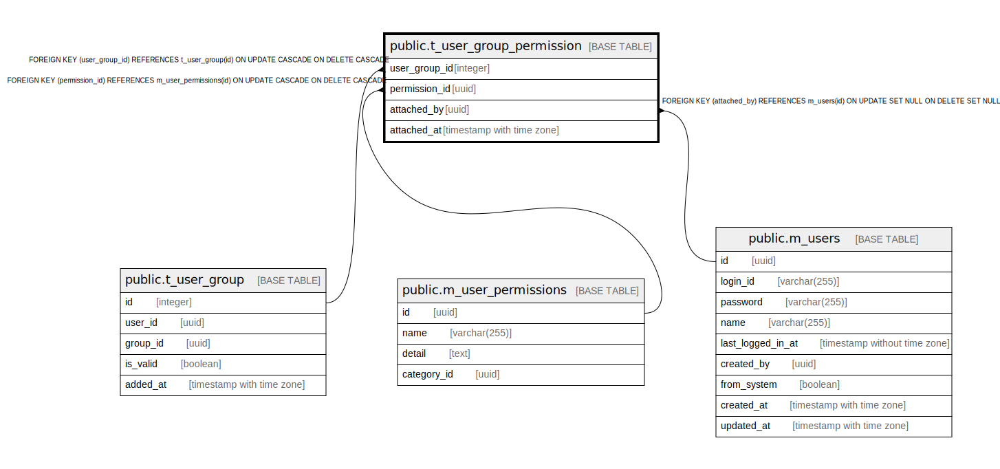

# public.t_user_group_permission

## Description

## Columns

| Name | Type | Default | Nullable | Children | Parents | Comment |
| ---- | ---- | ------- | -------- | -------- | ------- | ------- |
| user_group_id | integer |  | false |  | [public.t_user_group](public.t_user_group.md) |  |
| permission_id | uuid |  | false |  | [public.m_user_permissions](public.m_user_permissions.md) |  |
| attached_by | uuid |  | true |  | [public.m_users](public.m_users.md) |  |
| attached_at | timestamp with time zone |  | false |  |  |  |

## Constraints

| Name | Type | Definition |
| ---- | ---- | ---------- |
| t_user_group_permission_attached_by_fkey | FOREIGN KEY | FOREIGN KEY (attached_by) REFERENCES m_users(id) ON UPDATE SET NULL ON DELETE SET NULL |
| t_user_group_permission_user_group_id_fkey | FOREIGN KEY | FOREIGN KEY (user_group_id) REFERENCES t_user_group(id) ON UPDATE CASCADE ON DELETE CASCADE |
| t_user_group_permission_permission_id_fkey | FOREIGN KEY | FOREIGN KEY (permission_id) REFERENCES m_user_permissions(id) ON UPDATE CASCADE ON DELETE CASCADE |
| t_user_group_permission_pkey | PRIMARY KEY | PRIMARY KEY (user_group_id, permission_id) |

## Indexes

| Name | Definition |
| ---- | ---------- |
| t_user_group_permission_pkey | CREATE UNIQUE INDEX t_user_group_permission_pkey ON public.t_user_group_permission USING btree (user_group_id, permission_id) |

## Relations

---

> Generated by [tbls](https://github.com/k1LoW/tbls)
