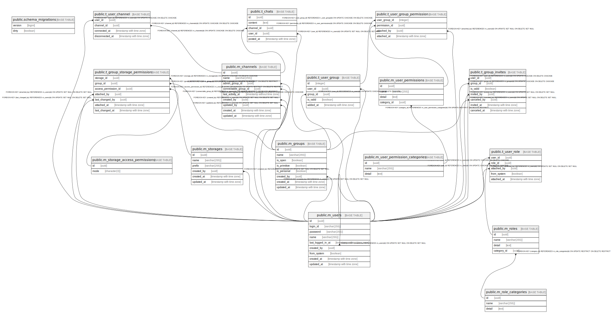

# gwork

## Tables

| Name | Columns | Comment | Type |
| ---- | ------- | ------- | ---- |
| [public.schema_migrations](public.schema_migrations.md) | 2 |  | BASE TABLE |
| [public.m_users](public.m_users.md) | 9 |  | BASE TABLE |
| [public.m_role_categories](public.m_role_categories.md) | 3 |  | BASE TABLE |
| [public.m_roles](public.m_roles.md) | 4 |  | BASE TABLE |
| [public.t_user_role](public.t_user_role.md) | 5 |  | BASE TABLE |
| [public.m_groups](public.m_groups.md) | 8 |  | BASE TABLE |
| [public.t_user_group](public.t_user_group.md) | 5 |  | BASE TABLE |
| [public.t_group_invites](public.t_group_invites.md) | 7 |  | BASE TABLE |
| [public.m_user_permission_categories](public.m_user_permission_categories.md) | 3 |  | BASE TABLE |
| [public.m_user_permissions](public.m_user_permissions.md) | 4 |  | BASE TABLE |
| [public.t_user_group_permission](public.t_user_group_permission.md) | 4 |  | BASE TABLE |
| [public.m_storage_access_permissions](public.m_storage_access_permissions.md) | 2 |  | BASE TABLE |
| [public.m_storages](public.m_storages.md) | 6 |  | BASE TABLE |
| [public.t_group_storage_permission](public.t_group_storage_permission.md) | 6 |  | BASE TABLE |
| [public.m_channels](public.m_channels.md) | 9 |  | BASE TABLE |
| [public.t_user_channel](public.t_user_channel.md) | 4 |  | BASE TABLE |
| [public.t_chats](public.t_chats.md) | 5 |  | BASE TABLE |

## Stored procedures and functions

| Name | ReturnType | Arguments | Type |
| ---- | ------- | ------- | ---- |
| public.uuid_nil | uuid |  | FUNCTION |
| public.uuid_ns_dns | uuid |  | FUNCTION |
| public.uuid_ns_url | uuid |  | FUNCTION |
| public.uuid_ns_oid | uuid |  | FUNCTION |
| public.uuid_ns_x500 | uuid |  | FUNCTION |
| public.uuid_generate_v1 | uuid |  | FUNCTION |
| public.uuid_generate_v1mc | uuid |  | FUNCTION |
| public.uuid_generate_v3 | uuid | namespace uuid, name text | FUNCTION |
| public.uuid_generate_v4 | uuid |  | FUNCTION |
| public.uuid_generate_v5 | uuid | namespace uuid, name text | FUNCTION |

## Relations

---

> Generated by [tbls](https://github.com/k1LoW/tbls)
