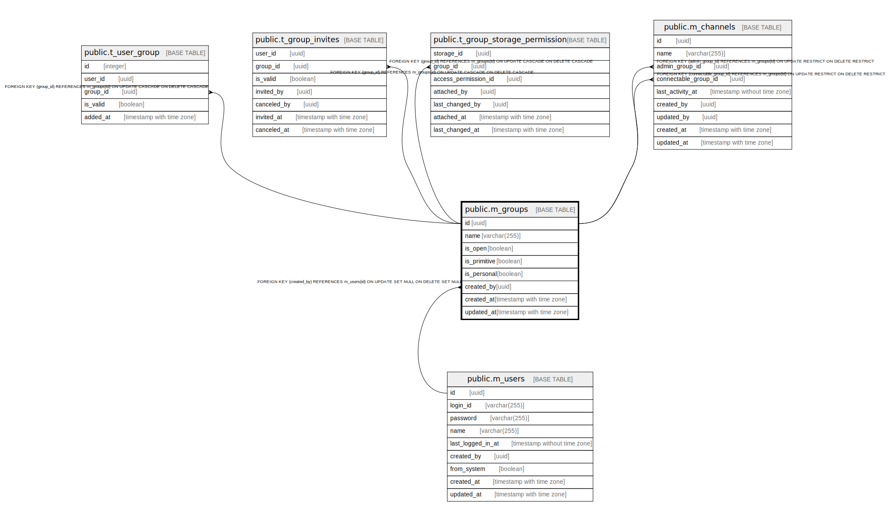

# public.m_groups

## Description

## Columns

| Name | Type | Default | Nullable | Children | Parents | Comment |
| ---- | ---- | ------- | -------- | -------- | ------- | ------- |
| id | uuid | uuid_generate_v4() | false | [public.t_user_group](public.t_user_group.md) [public.t_group_invites](public.t_group_invites.md) [public.t_group_storage_permission](public.t_group_storage_permission.md) [public.m_channels](public.m_channels.md) |  |  |
| name | varchar(255) |  | false |  |  |  |
| is_open | boolean |  | false |  |  |  |
| is_primitive | boolean |  | false |  |  |  |
| is_personal | boolean |  | false |  |  |  |
| created_by | uuid |  | true |  | [public.m_users](public.m_users.md) |  |
| created_at | timestamp with time zone |  | false |  |  |  |
| updated_at | timestamp with time zone |  | false |  |  |  |

## Constraints

| Name | Type | Definition |
| ---- | ---- | ---------- |
| m_groups_created_by_fkey | FOREIGN KEY | FOREIGN KEY (created_by) REFERENCES m_users(id) ON UPDATE SET NULL ON DELETE SET NULL |
| m_groups_pkey | PRIMARY KEY | PRIMARY KEY (id) |

## Indexes

| Name | Definition |
| ---- | ---------- |
| m_groups_pkey | CREATE UNIQUE INDEX m_groups_pkey ON public.m_groups USING btree (id) |
| idx_m_groups_name | CREATE INDEX idx_m_groups_name ON public.m_groups USING btree (name) |

## Relations

---

> Generated by [tbls](https://github.com/k1LoW/tbls)
