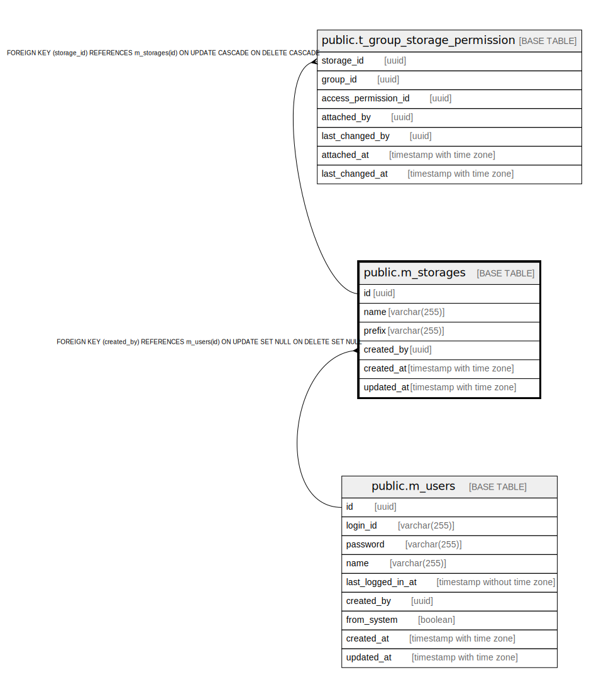

# public.m_storages

## Description

## Columns

| Name | Type | Default | Nullable | Children | Parents | Comment |
| ---- | ---- | ------- | -------- | -------- | ------- | ------- |
| id | uuid | uuid_generate_v4() | false | [public.t_group_storage_permission](public.t_group_storage_permission.md) |  |  |
| name | varchar(255) |  | false |  |  |  |
| prefix | varchar(255) |  | false |  |  |  |
| created_by | uuid |  | true |  | [public.m_users](public.m_users.md) |  |
| created_at | timestamp with time zone |  | false |  |  |  |
| updated_at | timestamp with time zone |  | false |  |  |  |

## Constraints

| Name | Type | Definition |
| ---- | ---- | ---------- |
| m_storages_created_by_fkey | FOREIGN KEY | FOREIGN KEY (created_by) REFERENCES m_users(id) ON UPDATE SET NULL ON DELETE SET NULL |
| m_storages_pkey | PRIMARY KEY | PRIMARY KEY (id) |
| m_storages_prefix_key | UNIQUE | UNIQUE (prefix) |

## Indexes

| Name | Definition |
| ---- | ---------- |
| m_storages_pkey | CREATE UNIQUE INDEX m_storages_pkey ON public.m_storages USING btree (id) |
| m_storages_prefix_key | CREATE UNIQUE INDEX m_storages_prefix_key ON public.m_storages USING btree (prefix) |
| idx_m_storages_name | CREATE INDEX idx_m_storages_name ON public.m_storages USING btree (name) |
| idx_m_storages_prefix | CREATE INDEX idx_m_storages_prefix ON public.m_storages USING btree (prefix) |

## Relations

---

> Generated by [tbls](https://github.com/k1LoW/tbls)
