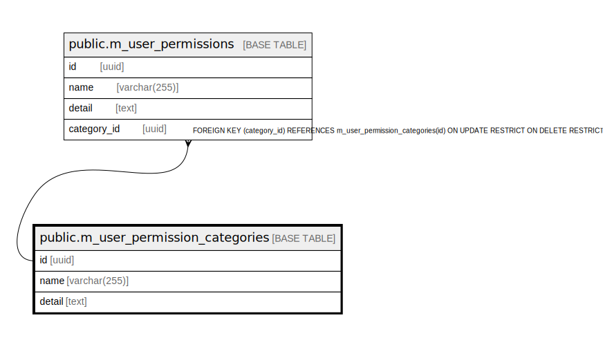

# public.m_user_permission_categories

## Description

## Columns

| Name | Type | Default | Nullable | Children | Parents | Comment |
| ---- | ---- | ------- | -------- | -------- | ------- | ------- |
| id | uuid | uuid_generate_v4() | false | [public.m_user_permissions](public.m_user_permissions.md) |  |  |
| name | varchar(255) |  | false |  |  |  |
| detail | text |  | false |  |  |  |

## Constraints

| Name | Type | Definition |
| ---- | ---- | ---------- |
| m_user_permission_categories_pkey | PRIMARY KEY | PRIMARY KEY (id) |

## Indexes

| Name | Definition |
| ---- | ---------- |
| m_user_permission_categories_pkey | CREATE UNIQUE INDEX m_user_permission_categories_pkey ON public.m_user_permission_categories USING btree (id) |
| idx_m_user_permission_categories_name | CREATE INDEX idx_m_user_permission_categories_name ON public.m_user_permission_categories USING btree (name) |

## Relations

---

> Generated by [tbls](https://github.com/k1LoW/tbls)
