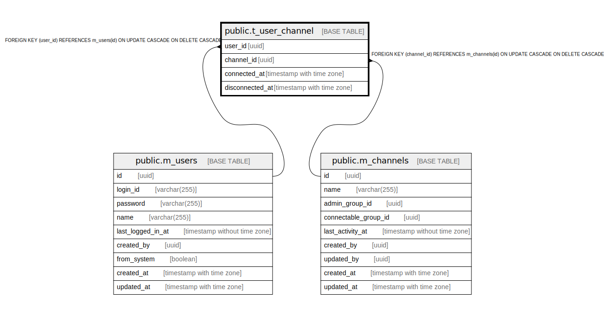

# public.t_user_channel

## Description

## Columns

| Name | Type | Default | Nullable | Children | Parents | Comment |
| ---- | ---- | ------- | -------- | -------- | ------- | ------- |
| user_id | uuid |  | false |  | [public.m_users](public.m_users.md) |  |
| channel_id | uuid |  | false |  | [public.m_channels](public.m_channels.md) |  |
| connected_at | timestamp with time zone |  | false |  |  |  |
| disconnected_at | timestamp with time zone |  | true |  |  |  |

## Constraints

| Name | Type | Definition |
| ---- | ---- | ---------- |
| t_user_channel_user_id_fkey | FOREIGN KEY | FOREIGN KEY (user_id) REFERENCES m_users(id) ON UPDATE CASCADE ON DELETE CASCADE |
| t_user_channel_channel_id_fkey | FOREIGN KEY | FOREIGN KEY (channel_id) REFERENCES m_channels(id) ON UPDATE CASCADE ON DELETE CASCADE |
| t_user_channel_pkey | PRIMARY KEY | PRIMARY KEY (user_id, channel_id) |

## Indexes

| Name | Definition |
| ---- | ---------- |
| t_user_channel_pkey | CREATE UNIQUE INDEX t_user_channel_pkey ON public.t_user_channel USING btree (user_id, channel_id) |

## Relations

---

> Generated by [tbls](https://github.com/k1LoW/tbls)
