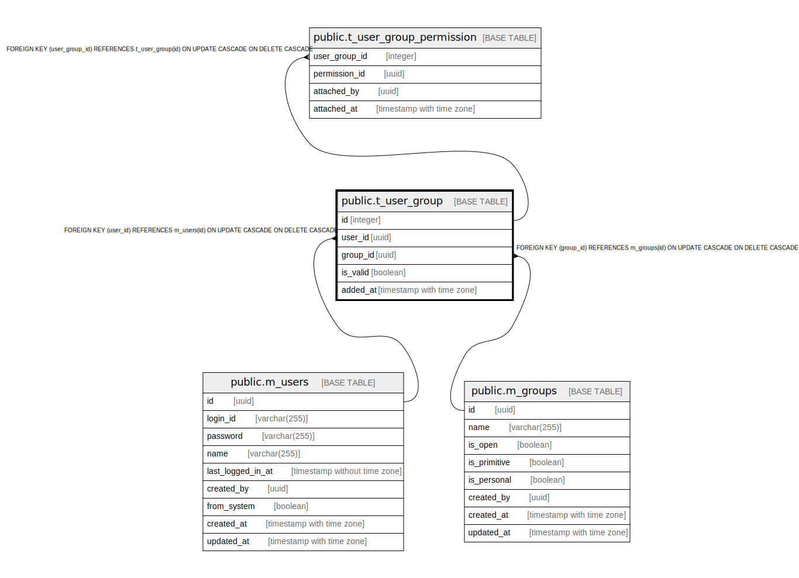

# public.t_user_group

## Description

## Columns

| Name | Type | Default | Nullable | Children | Parents | Comment |
| ---- | ---- | ------- | -------- | -------- | ------- | ------- |
| id | integer | nextval('t_user_group_id_seq'::regclass) | false | [public.t_user_group_permission](public.t_user_group_permission.md) |  |  |
| user_id | uuid |  | false |  | [public.m_users](public.m_users.md) |  |
| group_id | uuid |  | false |  | [public.m_groups](public.m_groups.md) |  |
| is_valid | boolean | true | false |  |  |  |
| added_at | timestamp with time zone |  | false |  |  |  |

## Constraints

| Name | Type | Definition |
| ---- | ---- | ---------- |
| t_user_group_user_id_fkey | FOREIGN KEY | FOREIGN KEY (user_id) REFERENCES m_users(id) ON UPDATE CASCADE ON DELETE CASCADE |
| t_user_group_group_id_fkey | FOREIGN KEY | FOREIGN KEY (group_id) REFERENCES m_groups(id) ON UPDATE CASCADE ON DELETE CASCADE |
| t_user_group_pkey | PRIMARY KEY | PRIMARY KEY (id) |

## Indexes

| Name | Definition |
| ---- | ---------- |
| t_user_group_pkey | CREATE UNIQUE INDEX t_user_group_pkey ON public.t_user_group USING btree (id) |

## Relations

---

> Generated by [tbls](https://github.com/k1LoW/tbls)
